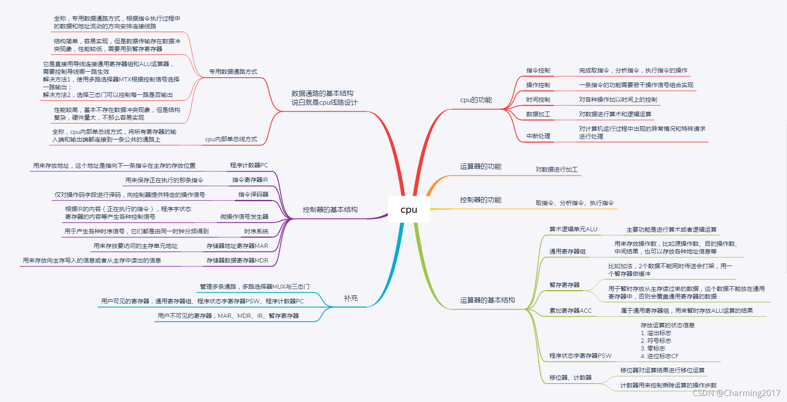
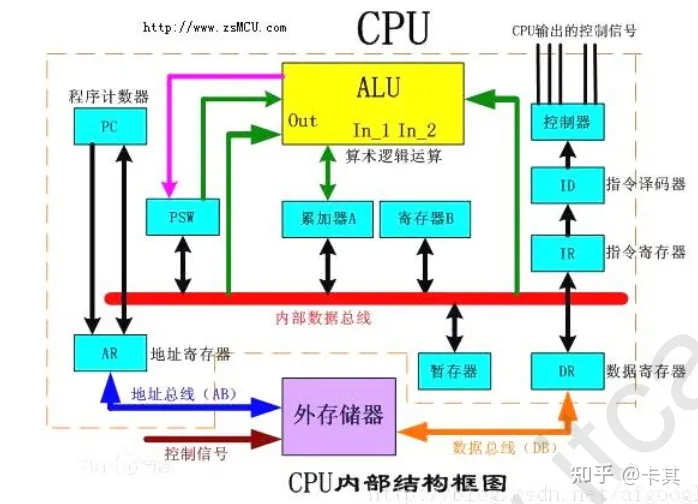
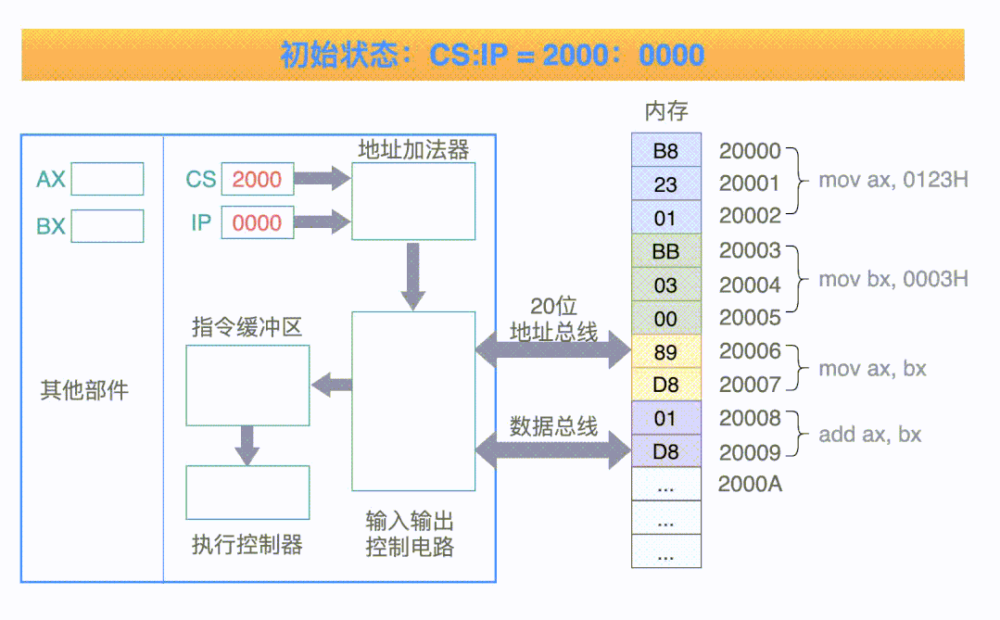

# CPU
:::tip RISC-V开源指令集
<a href="https://ysyx.oscc.cc/docs/" target="_blank">一生一芯</a>
:::
### CPU指令的执行过程  
  几乎所有的冯·诺伊曼型计算机的 CPU，其工作都可以分为 5 个阶段：取指令、指令译码、执行指令、访存取数、结果写回。  
  1. 取指令阶段  
  取指令（Instruction Fetch，IF）阶段是将一条指令从主存中取到指令寄存器的过程。 程序计数器 PC 中的数值，用来指示当前指令在主存中的位置。当一条指令被取出后，PC 中的数值将根据指令字长度而自动递增：若为单字长指令，则(PC)+1->PC；若为双字长指令，则(PC)+2->PC，依此类推。   
  2. 指令译码阶段  
  取出指令后，计算机立即进入指令译码（Instruction Decode，ID）阶段。 在指令译码阶段，指令译码器按照预定的指令格式，对取回的指令进行拆分和解释，识别区分出不同的指令类别以及各种获取操作数的方法。在组合逻辑控制的计算机中，指令译码器对不同的指令操作码产生不同的控制电位，以形成不同的微操作序列；在微程序控制的计算机中，指令译码器用指令操作码来找到执行该指令的微程序的入口，并从此入口开始执行。 在传统的设计里，CPU中负责指令译码的部分是无法改变的。不过，在众多运用微程序控制技术的新型 CPU 中，微程序有时是可重写的。  
  3. 执行指令阶段  
  在取指令和指令译码阶段之后，接着进入执行指令（Execute，EX）阶段。 此阶段的任务是完成指令所规定的各种操作，具体实现指令的功能。为此，CPU 的不同部分被连接起来，以执行所需的操作。 例如，如果要求完成一个加法运算，算术逻辑单元 ALU 将被连接到一组输入和一组输出，输入端提供需要相加的数值，输出端将含有最后的运算结果。  
  4. 访存取数阶段  
  根据指令需要，有可能要访问主存，读取操作数，这样就进入了访存取数（Memory，MEM）阶段。 此阶段的任务是：根据指令地址码，得到操作数在主存中的地址，并从主存中读取该操作数用于运算。  
  5. 结果写回阶段  
  作为最后一个阶段，结果写回（Writeback，WB）阶段把执行指令阶段的运行结果数据“写回”到某种存储形式：结果数据经常被写到 CPU 的内部寄存器中，以便被后续的指令快速地存取；在有些情况下， 结果数据也可被写入相对较慢、但较廉价且容量较大的主存。许多指令还会改变程序状态字寄存器中标志位 的状态，这些标志位标识着不同的操作结果，可被用来影响程序的动作。  

  在指令执行完毕、结果数据写回之后，若无意外事件（如结果溢出等）发生，计算机就接着从程序计数器 PC 中取得下一条指令地址，开始新一轮的循环，下一个指令周期将顺序取出下一条指令。许多新型 CPU 可以同时取出、译码和执行多条指令，体现并行处理的特性。  

   
   
   

### 冯·诺依曼机结构 
数学家冯·诺依曼提出了计算机制造的三个基本原则，即采用二进制逻辑、程序存储执行以及计算机由五个部分组成：运算器控制器存储器输入设备输出设备现代计算机发展所遵循的基本结构形式始终是冯·诺依曼机结构。这种结构特点是“程序存储，共享数据，顺序执行”，需要 CPU 从存储器取出指令和数据进行相应的计算。
1. 单处理机结构，机器以运算器为中心 
2. 采用程序存储思想  
3. 指令和数据一样可以参与运算   
4. 数据以二进制表示   
5. 将软件和硬件完全分离   
6. 指令由操作码和操作数组成   
7. 指令顺序执行。这套理论被称为冯·诺依曼体系结构  

 <a href="https://www.shuzhiduo.com/A/mo5kVBXMJw/" target="_blank">术之多</a>
