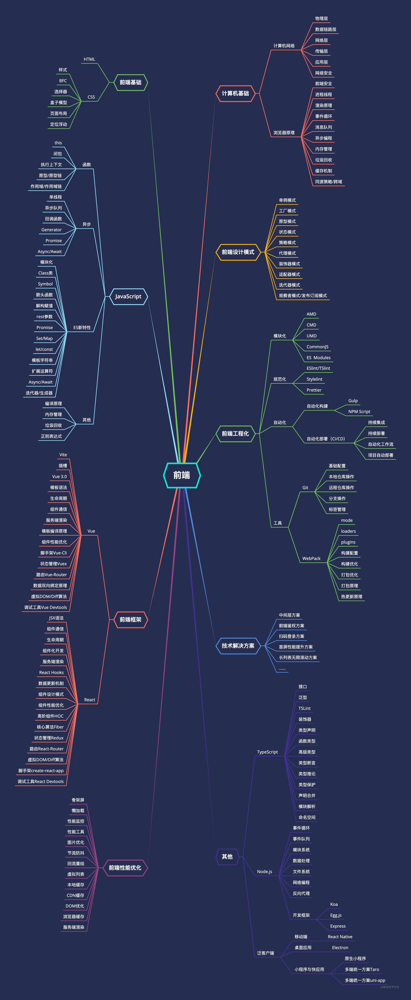
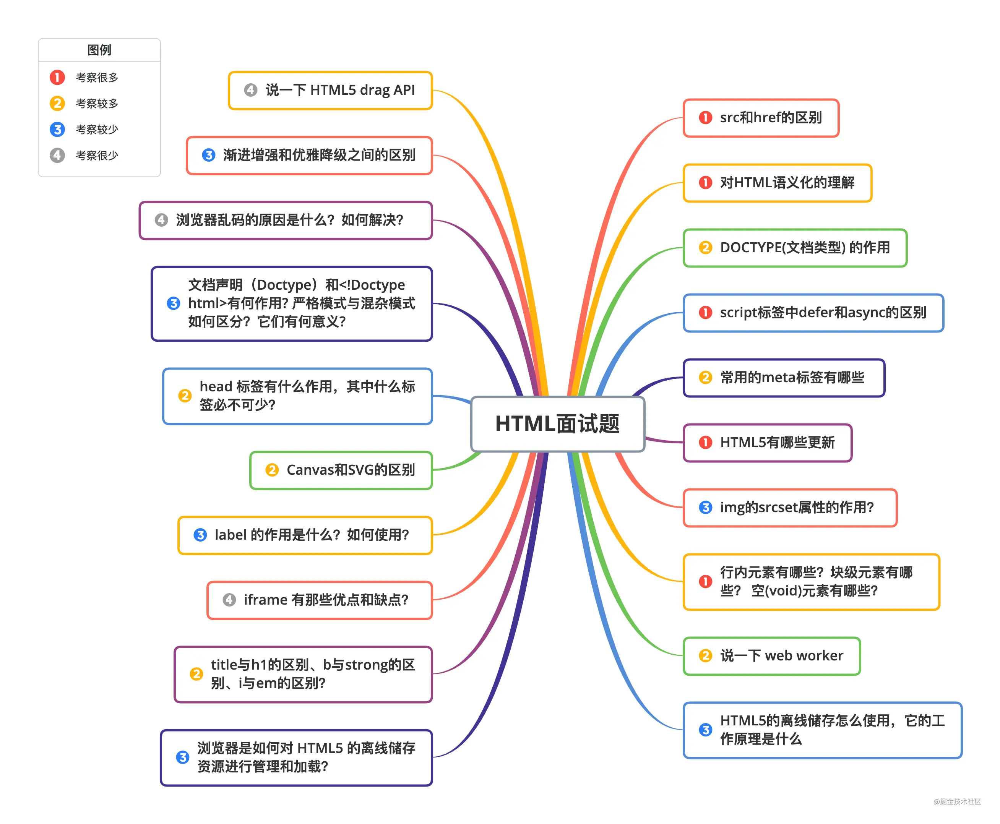
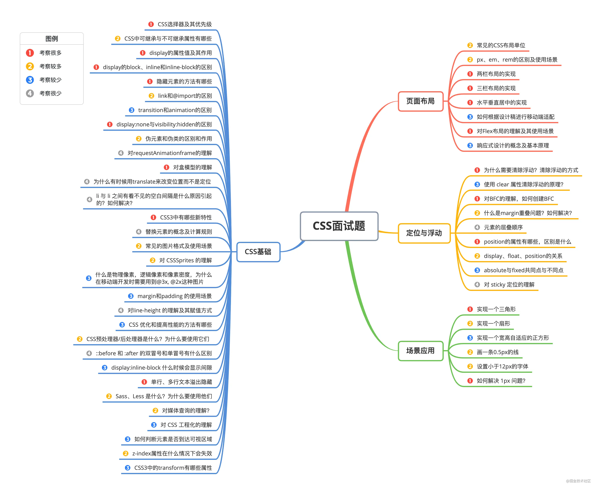
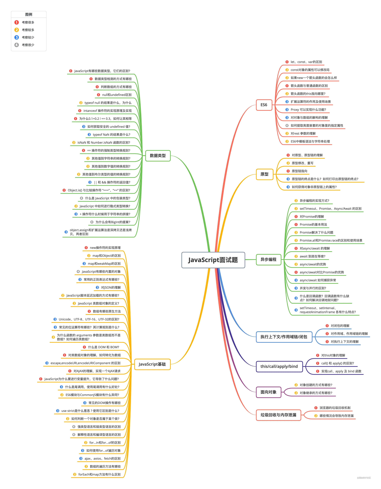
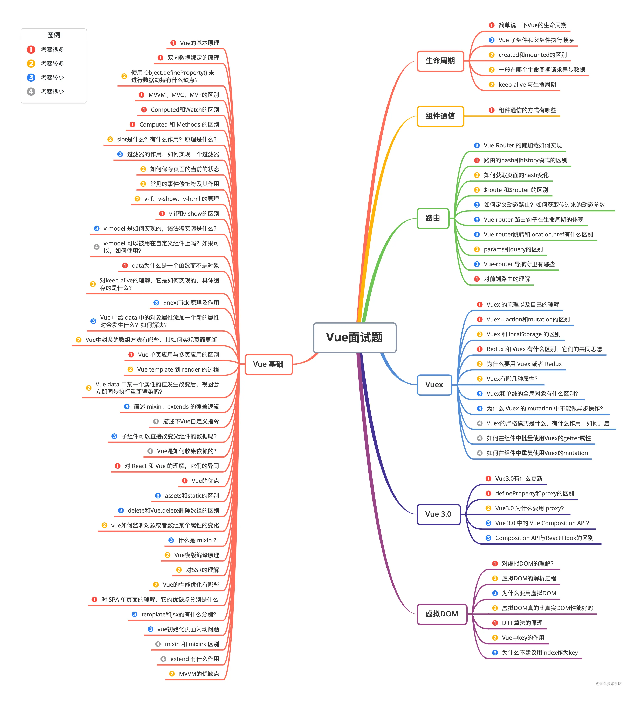
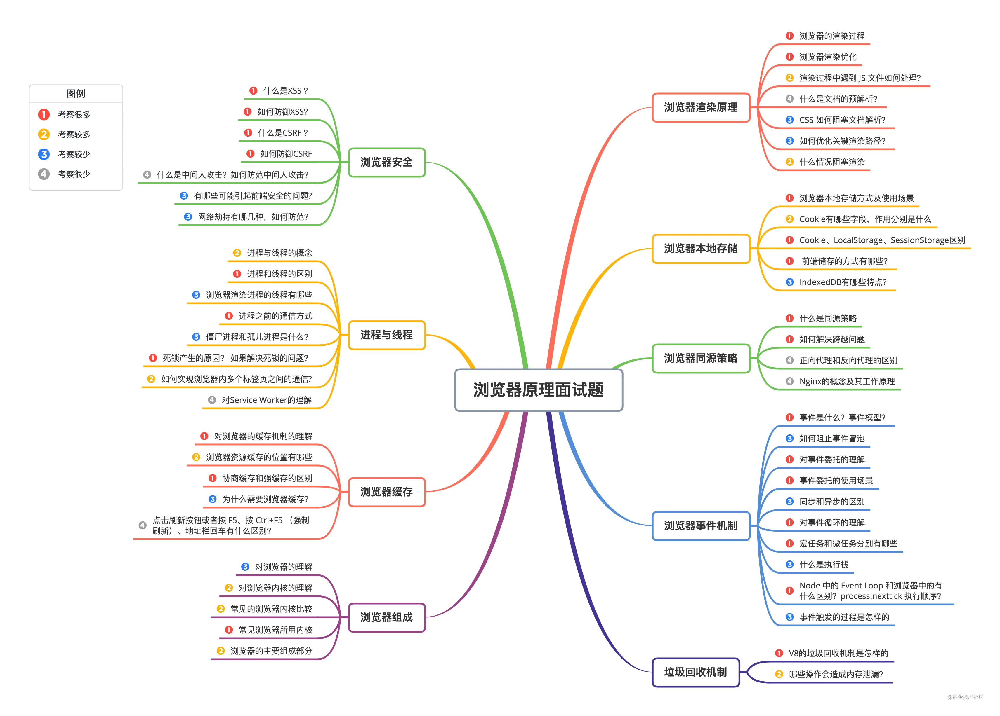
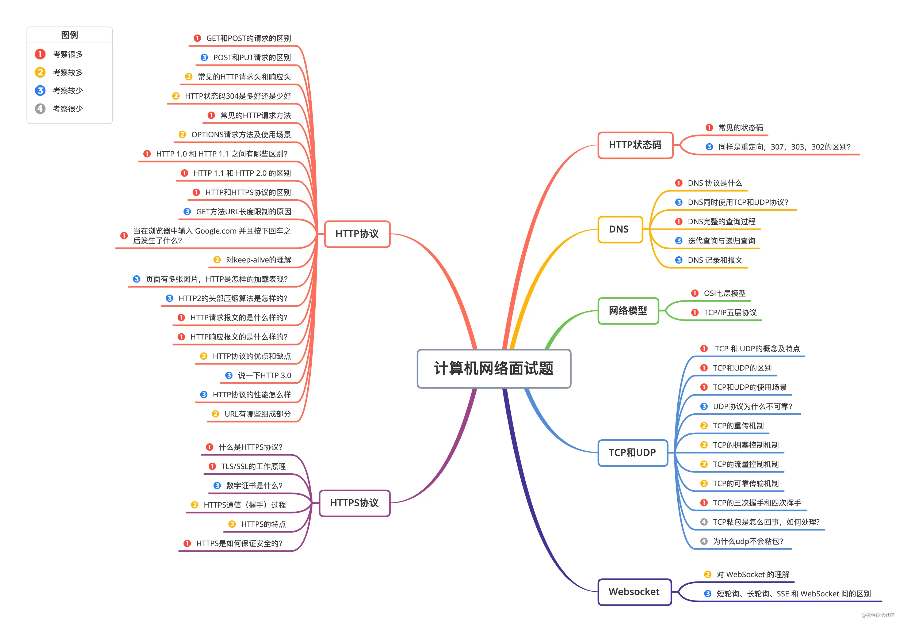
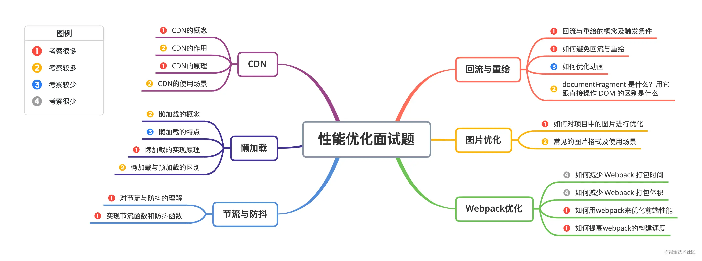
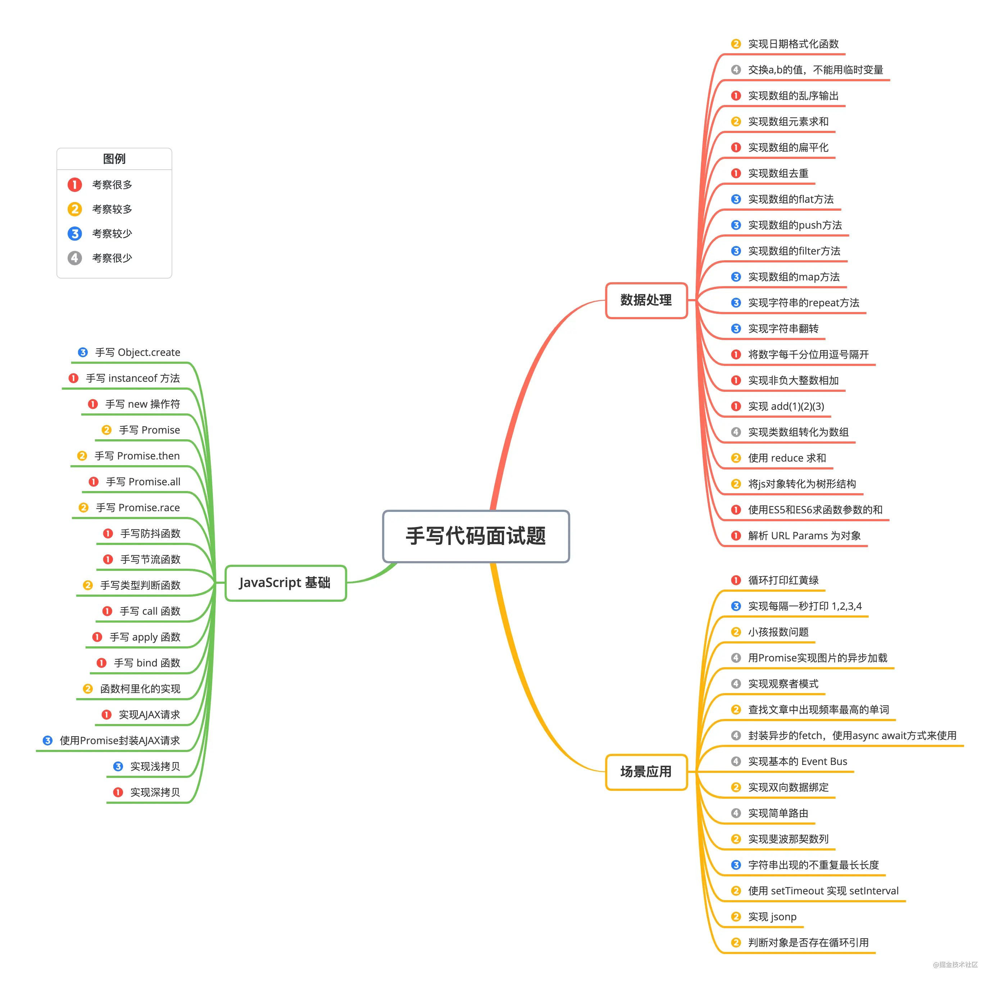

# 面试点总结-1
<a href="https://juejin.cn/post/6996841019094335519" target="_blank">参考地址</a>  

## 思维导图总结
  

## html方面
  

## css方面
  

## JavaScript基础
  

## Vue  
  

## React 
  

## 浏览器原理
  

## 计算机网络
  

## 前端性能优化
  

## 手写代码
  