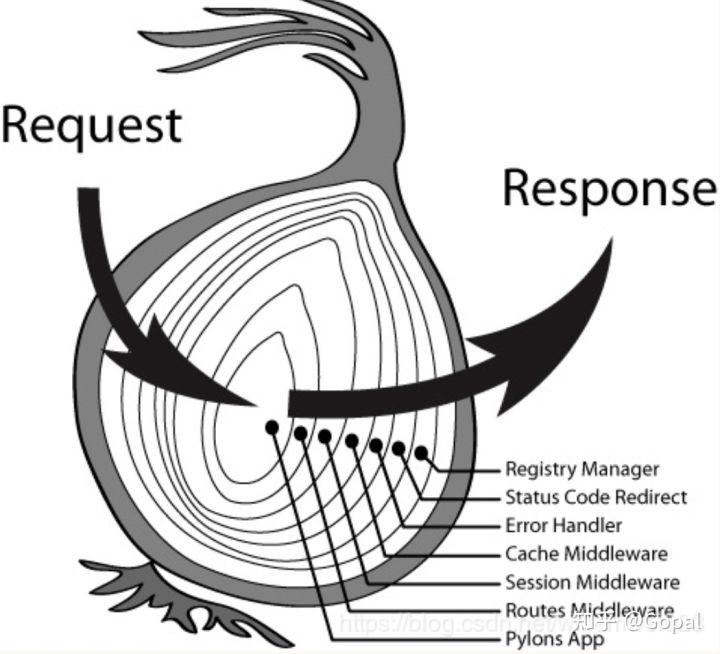
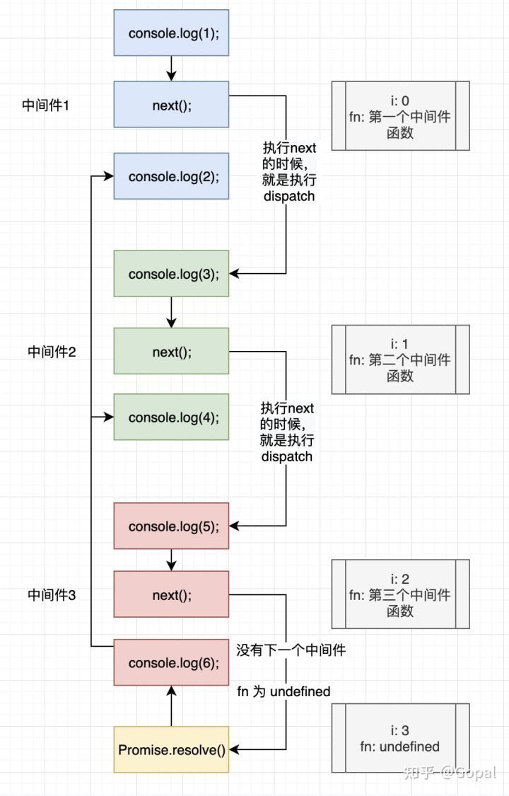

# node
入门参考文档：点击<a href="https://www.nodebeginner.org/index-zh-cn.html" target="_blank">这里</a>
### 动态刷新node服务器的插件
用法：`nodemon practice.js`

## Restful
接口访问的地址路径相同，只是method不同。
+ `GET`获取列表
+ `POST`提交表单
+ `PUT`修改表单
+ `DELETE`删除记录

## koa的洋葱模型
  
  
Koa 的洋葱模型指的是以 next() 函数为分割点，先由外到内执行 Request 的逻辑，再由内到外执行 Response 的逻辑。通过洋葱模型，将多个中间件之间通信等变得更加可行和简单。其实现的原理并不是很复杂，主要是 compose 方法。

## 函数列表
+ process是node的全局变量。
+ path.resolve()  
   path.resolve 这个方法通过解析一系列字符串，最终返回一个绝对路径。关键在于绝对路径。  
   解析的方式是从右向左，直到拼成一个绝对路径就自动停止。   
   如果全部路径都拼完了，还没有形成绝对路径，那就把当前路径加上。  
   如果没有参数，path.resolve()返回当前路径。  
   ``` js
   path.resolve('/foo', '/bar', 'baz') //Returns: 返回/bar/baz
    处理过程为，从右向左
    baz 不是绝对路径， 加上上一个参数变成 /bar/baz 就是已经绝对路径了，
    所以第一个参数 '/foo' 就用不上了。

    path.resolve('/foo/bar', './baz');// Returns: '/foo/bar/baz'

    path.resolve('/foo/bar', '/tmp/file/');// Returns: '/tmp/file'
    // 最后一个参数直接就是绝对路径，第一个参数就用不上了。

    path.resolve('wwwroot', 'static_files/png/', '../gif/image.gif');
    // If the current working directory is /home/myself/node,
    // this returns '/home/myself/node/wwwroot/static_files/gif/image.gif'

    这几个参数都解析完之后是
    'wwwroot/static_files/png/../gif/image.gif'
    这并不是一个绝对路径，所以把当前路径加到最前面。
    就变成了
    '/home/myself/node/wwwroot/static_files/png/../gif/image.gif'
    简化一下就是
    '/home/myself/node/wwwroot/static_files/gif/image.gif'
   ```
+ __dirname 是node的一个全局变量，获得当前文件所在目录的完整目录名。