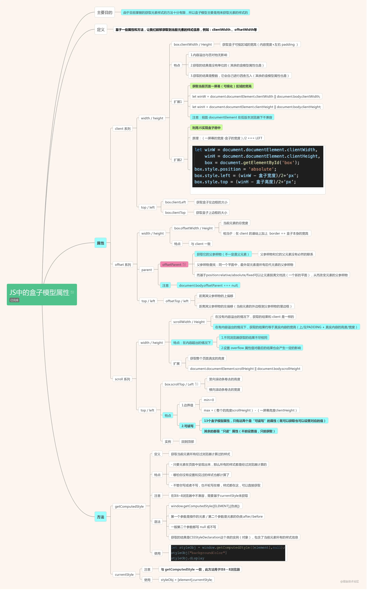

# CSS
## 盒子模型
   

## box-sizing
|                     |                content-box               |                border-box                 |
|         -:          |                    :-:                   |                   :-:                     |
|        名称         |               标准(chrome)               |                   怪异(IE)                 |
|        特点         |默认值，标准盒子模型。 width 与 height 只包括内容的宽和高， 不包括边框（border），内边距（padding），外边距（margin）。<br>注意: 内边距、边框和外边距都在这个盒子的外部。 比如说，.box {width: 350px; border: 10px solid black;} 在浏览器中的渲染的实际宽度将是 370px。| width 和 height 属性包括内容，内边距和边框，但不包括外边距。这是当文档处于 Quirks模式 时Internet Explorer使用的盒模型。<br>注意，填充和边框将在盒子内 , 例如, .box {width: 350px; border: 10px solid black;} 导致在浏览器中呈现的宽度为350px的盒子。内容框不能为负，并且被分配到0，使得不可能使用border-box使元素消失。|
|尺寸计算公式|width = 内容的宽度<br>height = 内容的高度<br>宽度和高度的计算值都不包含内容的边框（border）和内边距（padding）。|width = border + padding + 内容的宽度<br>height = border + padding + 内容的高度|

### 文字流光效果
``` css
.it {
    display: block;
/*渐变背景，此处为能无缝拼接的渐变 即0~100%*/   /*linear-gradient(线性渐变)*/background-image: -webkit-linear-gradient(left, #3498db, #f47920 10%, #d71345 20%, #f7acbc 30%, #ffd400 40%, #3498db 50%, #f47920 60%, #d71345 70%, #f7acbc 80%, #ffd400 90%, #3498db);color: transparent; /*文字填充色为透明*/-webkit-text-fill-color: transparent;-webkit-background-clip: text; /* background-clip 规定背景的绘制区域：*/   /*背景剪裁为文字，相当于用背景填充文字 CSS3新属性*/-webkit-background-size: 200% 100%; /*背景图片向水平方向扩大一倍，这样background-position才有移动与变化的空间*/background-size: 200% 100%;
/* 动画 */-webkit-animation: it-animation 4s infinite linear;}
@keyframes it-animation {
0% {
background-position: 0 0;   /*background-position 属性设置背景图像的起始位置。*/
}
100% {
background-position: -100% 0;
}
}
```