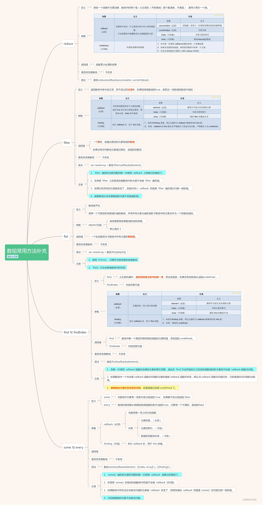

# JS函数大全

<a href="http://jquery.cuishifeng.cn/" target="_blank">jquery api</a>  

## 原型链  
+ 当谈到继承时，JavaScript 只有一种结构：对象。每个实例对象（ object ）都有一个私有属性（称之为 __proto__ ）指向它的构造函数的原型对象（prototype ）。该原型对象也有一个自己的原型对象( __proto__ ) ，层层向上直到一个对象的原型对象为 null。根据定义，null 没有原型，并作为这个原型链中的最后一个环节。
+ __proto__ 是原型链查询中实际用到的，它总是指向 prototype
+ prototype 是函数所独有的，在定义构造函数时自动创建，它总是被 __proto__ 所指。
+ 所有对象都有__proto__属性，函数这个特殊对象除了具有__proto__属性，还有特有的原型属性prototype。prototype对象默认有两个属性，constructor属性和__proto__属性。prototype属性可以给函数和对象添加可共享（继承）的方法、属性，而__proto__是查找某函数或对象的原型链方式。constructor，这个属性包含了一个指针，指回原构造函数。

## 其它
+ **for in**循环的是对象的key值，**for of**循环的是对象的value值，数组为特殊对象，key值就是索引值。 
+ 可以通过`arguments`查看函数参数。
+ 箭头函数捕捉闭包上下文的this值。
+ **delete**操作符，删除一个对象的属性或者一个数组中某一个键值。删除数组的某一项只是使其变为undefined，长度不会变化。
+ **in**操作符，可以判断对象的key值是否在对象中，或者数组索引值是否在数组中。
+ **instanceof**操作符，如果所判别的对象确实是所指定的类型，则返回true。Date，String本质上是函数，Math是对象。
+ 浏览器中输入`Date.prototype`可以输出所有可用属性和方法。
+ <a href="https://developer.mozilla.org/zh-CN/docs/Web/JavaScript/Guide/Regular_Expressions" target="_blank">正则表达式参考文档</a>

+ **forEach**只是遍历数组，**map**则可以遍历数组，并进行一些操作后返回一个新数组。  
  **filter**是筛选符合条件的元素，**every**是所有项符合条件则为true，**some**是有一项符合条件则为true。  
  **reduce**是传入的两个相邻索引作为参数，**reduceRight**是从后往前遍历。<a target="_blank"
  href="https://developer.mozilla.org/zh-CN/docs/Web/JavaScript/Guide/Indexed_collections">MDN参考</a>  

+ **Map**有着类似object的键值对。  <a target="_blank" 
  href="https://developer.mozilla.org/zh-CN/docs/Web/JavaScript/Guide/Keyed_collections">MDN参考</a>  
  **Set**对象允许你存储任何类型的唯一值，无论是原始值或者是对象引用。结构类似Array。
+ 所有的 JavaScript 对象至少继承于一个对象。被继承的对象被称作原型，并且继承的属性可通过构造函数的**prototype**对象找到。
+ 如果希望对象的属性具有默认值，并且希望在运行时修改这些默认值，应该在对象的原型中设置这些属性，而不是在构造器函数中。
+ <a href="https://developer.mozilla.org/zh-CN/docs/Web/JavaScript/Equality_comparisons_and_sameness" target="_blank">JavaScript 中的相等性判断</a>

```js
function Engineer (name, projs, mach) {
  this.base = WorkerBee;
  this.base(name, "engineering", projs);
  this.machine = mach || "";
}

var jane = new Engineer("Doe, Jane", ["navigator", "javascript"], "belau");
```
1. new 操作符创建了一个新的对象，并将其 __proto__ 属性设置为 Engineer.prototype。
2. new 操作符将该新对象作为 this 的值传递给 Engineer 构造函数。
3. 构造函数为该新对象创建了一个名为 base 的新属性，并指向 WorkerBee 的构造函数。这使得 WorkerBee 构造函数成为 Engineer 对象的一个方法。base属性的名称并没有什么特殊性，我们可以使用任何其他合法的名称来代替；base 仅仅是为了贴近它的用意。
4. 构造函数调用 base 方法，将传递给该构造函数的参数中的两个，作为参数传递给 base 方法，同时还传递一个字符串参数  "engineering"。显式地在构造函数中使用 "engineering" 表明所有 Engineer 对象继承的 dept 属性具有相同的值，且该值重载了继承自 Employee 的值。

5. 因为 base 是 Engineer 的一个方法，在调用 base 时，JavaScript 将在步骤 1 中创建的对象绑定给 this 关键字。这样，WorkerBee 函数接着将 "Doe, Jane" 和 "engineering" 参数传递给 Employee 构造函数。当从 Employee 构造函数返回时，WorkerBee 函数用剩下的参数设置 projects 属性。
6. 当从 base 方法返回后，Engineer 构造函数将对象的 machine 属性初始化为 "belau"。
7. 当从构造函数返回时，JavaScript 将新对象赋值给 jane 变量。  


```
var parts = ['shoulder', 'knees'];
var lyrics = ['head', ...parts, 'and', 'toes'];

function f(x, y, z) { }
var args = [0, 1, 2];
f(...args);

===============================

var o = new Foo();

JavaScript 实际上执行的是：
var o = new Object();
o.__proto__ = Foo.prototype;
Foo.call(o);

o.someProp;
它检查 o 是否具有 someProp 属性。如果没有，它会查找 Object.getPrototypeOf(o).someProp，如果仍旧没有，它会继续查找 Object.getPrototypeOf(Object.getPrototypeOf(o)).someProp。
```

## 原生js函数和jquery函数  
```js
array创建数组
concat()连接两个或更多的数组，并返回结果。
join()把数组中所有元素组成字符串。
pop()删除并返回数组的最后一个元素
sort()对数组进行排序
toString()把数组转换为字符串，并返回结果。
push()向数组的末尾添加一个或多个元素，并返回新的长度。
shift()删除并返回数组的第一个元素
reverse()反转数组中元素的顺序。
unshift()向数组的开头添加一个或多个元素
splice()从数组中删除元素（并添加新元素），返回被删除的元素。
slice()从数组返回选定的元素
valueOf()返回 Array 对象的原始值
 
JAVASCRIPT String 函数
toLowerCase()把字符串转换为小写。
toUpperCase()把字符串转换成大写。
substr()从字符串中截取指定长度的字符。
split()把字符串分割为数组。
replace()替换字符串中匹配的字符。
substring()截取字符串中指定长度的字符。
length获取字符串长度
search()搜索字符串中与正则表达式/字符相匹配的第一个匹配的位置。
match()在字符串中搜索指定的值，或与正则表达式的匹配的值
trim()去除字符串两边的空白，空格
indexOf()返回指定的字符串值在字符串中首次出现的位置
charAt()返回指定位置的字符
 
JAVASCRIPT Date 函数
Date()返回当天的日期和时间
getDate()返回当前月份的日期
getDay()从日期对象返回一周中的某一天 (0 ~ 6)。
getMonth()从日期对象返回月份 (0 ~ 11)。
getFullYear()返回日期中的年份
getHours()返回日期对象的小时 (0 ~ 23)。
getMinutes()返回日期对象的分钟 (0 ~ 59)
getSeconds()返回日期对象的秒数 (0 ~ 59)。
getMilliseconds()返回日期对象的毫秒(0 ~ 999)。
getTime()返回 1970 年 1 月 1 日至今的毫秒数
parse()解析一个日期时间字符串，并返回毫秒数
setTime()以毫秒设置 Date 对象
setHours()设置date对象的小时，分钟，秒和毫秒
toDateString()把 Date 对象的日期部分转换为字符串。
setMinutes()设置date对象的分钟，秒和毫秒
 
JAVASCRIPT Mach 函数
abs()获取绝对值
acos()反余弦值
asin()反正弦值
atan()反正切值
atan2()两个变量 x 和 y 的反正切值
ceil()向上取整
cos()返回数的余弦值
max()返回给出的数值中较大者。
min()返回给出的数值中较小的值
random()产生一个 0 和 1 之间的随机数
round()返回与给出的数值最接近的整数
 
JAVASCRIPT Regexp 函数
test()检索与正则表达式是否匹配。
exec()查找字符串中指定的值
 
JAVASCRIPT Location 函数
hashlocation.hash获取或设置页面的锚点名称
hostnamelocation.hostname设置或取得当前 URL 的主机名
hreflocation.href设置或获取当前URL
reload()location.reload重新加载（刷新）当前页面
 
JAVASCRIPT Window 函数
setTimeout()指定的毫秒数后调用函数
setInterval()周期性（定时）调用函数（以毫秒计）
alert()显示带有一段信息和一个确认按钮的警告框。
blur()使窗体或元素失去焦点
clearInterval()取消setInterval函数将要执行的代码。
clearTimeout()取消setTimeout函数将要执行的代码
close()关闭浏览器窗口
confirm()显示一个带有指定消息的确认对话框。
focus()使窗口，元素获取焦点
prompt()显示可提示用户输入的对话框。
open()打开一个新的浏览器窗口或查找一个已命名的窗口。
resizeBy()按照指定的像素调整窗口的大小。
resizeTo()把窗口的大小调整到指定的宽度和高度。
scrollBy()按指定的像素值来滚动滚动条。
scrollTo()把滚动条滚动到指定的坐标。
moveBy()把窗口的坐标移动指定的像素
moveTo()把窗口移动到一个指定的坐标
 
JAVASCRIPT Other 函数
encodeURI()字符串进行URI编码
decodeURI()解码编码过的 URI 字符串
write()在文档中输出字符串
top取得最顶层框架对象
self获取当前窗口对象
eval()把一个字符串当做 JavaScript 代码来执行
isNaN()检查参数是否是非数字值
parseInt()解析一个字符串并返回一个整数。
parseFloat()解析一个字符串，并返回一个浮点数(小数)。
escape()对字符串进行编码。
unescape()对由 escape() 编码的字符串进行解码。
title返回当前文档的标题
domain返回当前文档的服务器域名
typeof检测给定变量的数据类型
decodeURIComponent()URI解码
encodeURIComponent()进行URI编码
isFinite()检查是否无穷大
arguments传递给函数的参数列表
console控制台对象
prototype对象类型原型的引用
XMLHttpRequest()XMLHttpRequest 对象
offsetWidth对象实际所占的宽度
offsetTop距上方或父级元素的上边框的距离
scrollHeight获取指定对象的的高度
 
JAVASCRIPT History 函数
back()返回上一个页面。
go()访问历史列表中的某个具体的页面
forward()访问历史列表中的下一个页面
 
JAVASCRIPT Navigator 函数
 
userAgentnavigator.userAgent返回由用户发送服务器的 user-agent 头部的值。
platformnavigator.platform返回用户运行浏览器的操作系统平台。
 
JAVASCRIPT Event 函数
onabort图像加载中断时触发事件
onblur元素失去焦点时触发事件
onchange当内容改变时触发事件
onclick当左键点击因素时触发事件
ondblclick当左键双击因素时触发事件
onerror加载文档或图像发生错误时触发事件。
onfocus元素获得焦点时触发事件
onkeydown某个键盘按键被按下时触发事件
onkeyup某个键盘按键被松开时触发事件
onkeypress某个键盘按键被按下并松开时触发事件
onload一个页面或一幅图像加载完成时触发事件
onmousedown当鼠标按钮被按下时触发事
onmousemove鼠标指针在绑定元素上方移动时触发事件
onmouseout鼠标指针移出指定的元素时触发事件
onmouseover鼠标指针移动到指定的元素上时触发事件
onmouseup鼠标按键被松开时触发事件
onreset表单中的重置按钮被点击时触发事件
onresize在调整窗口或框架大小时触发事件
onselect在文本框中的文本被选中时触发事件
onsubmit在表单被提交时触发事件
onunload在用户退出页面时（关闭浏览器或者刷新页面）触发事件
oninput检测用户的输入状态
keyCode监听键盘按键触发相应事件
target获得触发事件的元素
stopPropagation()禁止事件冒泡
button在鼠标点击时返回一个值
preventDefault()取消事件的默认动作。
addEventListener()事件监听处理函数
 
JAVASCRIPT Dom 函数
getElementsByTagName()获取指定标签名的对象集合
getElementsByName()获取带有指定名称(name)的对象集合
getElementById()获取指定 id 的第一个对象元素
innerHTML设置或返回标签之间的 HTML 内容
hasAttribute()判断标签是否含有指定属性
setAttribute()添加指定的属性，并为其赋值
removeChild()删除指定元素的某个指定的子节点
childNodes获得指定元素的子节点集合
className设置或获取元素的 class 属性
appendChild()向节点末添加一个子节点
createElement()创建元素节点
insertBefore()在指定的子节点之前插入新的子节点
innerText设置或获取节点的文本
lastChild获取最后一个子节点
firstChild获取第一个子节点
nextSibling返回同级节点相邻的下一个节点
previousSibling返回同级节点相邻的上一个节点
parentNode返回元素的父节点
removeAttribute()删除标签指定的属性
createTextNode()document.createTextNode()创建新文本节点
nodeName获取标签节点的名称
createAttribute()创建一个指定名称的属性
querySelector()获取指定 CSS 第一个元素
getAttribute()获取指定属性名的属性值
getAttributeNode()获取属性节点
 
JAVASCRIPT Json 函数
stringify()系列化对象
JSON.parse()解析JSON字符串
 
JQUERY Core 函数
$()动态创建由 jQuery 对象包装的 DOM 元素。适用版本：1.6
$.unique()去重排序函数适用版本：1.7
$.inArray()在数组中搜索指定的值并返回其索引适用版本：1.6
$.merge()合并数组
 
JQUERY Param 函数
attr()设置或返回被选元素的属性值。适用版本：1.7
removeAttr()从每一个匹配的元素中删除一个属性适用版本：1.7
prop()获取在匹配的元素集中的第一个元素的属性值。适用版本：1.7
removeProp()用来删除由.prop()方法设置的属性集适用版本：1.7
addClass()为每个匹配的元素添加指定的类名。适用版本：1.7
removeClass()从所有匹配的元素中删除全部或者指定的类。适用版本：1.7
toggleClass()如果存在（不存在）就删除（添加）一个类。适用版本：1.7
html()取得第一个匹配元素的html内容。适用版本：1.7
val()返回或设置被选元素的值。适用版本：1.7
text()设置，取得所有匹配元素的内容。适用版本：1.7
 
JQUERY Css 函数
css()访问或设置匹配元素的样式属性。适用版本：1.7
offset()获取匹配元素在当前视口的相对偏移。适用版本：1.7
position()获取匹配元素相对父元素的偏移。适用版本：1.7
scrollTop()获取匹配元素相对滚动条顶部的偏移。适用版本：1.7
scrollLeft()获取匹配元素相对滚动条左侧的偏移。适用版本：1.7
height()取得匹配元素当前计算的高度值（px）。适用版本：1.7
width()取得第一个匹配元素当前计算的宽度值（px）。适用版本：1.7
innerHeight()获取第一个匹配元素内部区域高度（包括补白、不包括边框）。适用版本：1.7
innerWidth()获取第一个匹配元素内部区域宽度（包括补白、不包括边框）。适用版本：1.7
outerHeight()获取第一个匹配元素外部高度（默认包括补白和边框）。适用版本：1.7
outerWidth()获取第一个匹配元素外部宽度（默认包括补白和边框）。适用版本：1.7
 
JQUERY Select 函数
:enabled匹配所有可用元素适用版本：1.6
:disabled匹配所有不可用元素适用版本：1.6
:checked匹配所有选中的被选中元素适用版本：1.6
:selected匹配所有选中的option元素适用版本：1.6
:contains()匹配包含给定文本的元素适用版本：1.6
:empty匹配所有不包含子元素或者文本的空元素适用版本：1.6
:has()匹配含有选择器所匹配的元素的元素适用版本：1.6
:parent匹配含有子元素或者文本的元素适用版本：1.6
:first获取第一个元素适用版本：1.6
:last获取最后个元素适用版本：1.6
:not()去除所有与给定选择器匹配的元素适用版本：1.6
:even匹配所有索引值为偶数的元素适用版本：1.6
:odd匹配所有索引值为奇数的元素适用版本：1.6
:eq()匹配一个给定索引值的元素适用版本：1.6
:gt()匹配所有大于给定索引值的元素适用版本：1.6
:lt()匹配所有小于给定索引值的元素适用版本：1.6
:header匹配如 h1, h2, h3之类的标题元素适用版本：1.6
:animated匹配所有正在执行动画效果的元素适用版本：1.6
:focus触发每一个匹配元素的focus事件。适用版本：1.6
id根据给定的ID匹配一个元素适用版本：1.6
element根据给定的元素名匹配所有元素适用版本：1.6
class根据给定的类匹配元素。适用版本：1.6
*匹配所有元素适用版本：1.6
selectors将每一个选择器匹配到的元素合并后一起返回。适用版本：1.6
:input匹配所有 <input> 元素适用版本：1.6
:text匹配所有 type="text" 的 <input> 元素适用版本：1.6
:password匹配所有 type="password" 的 <input> 元素适用版本：1.6
:radio匹配所有 type="radio" 的 input 元素适用版本：1.6
:checkbox匹配所有 type="checkbox" 的 input 元素（多选框）适用版本：1.6
:submit匹配所有 type="submit" 的 input 元素适用版本：1.6
:reset匹配所有 type="reset" 的 input 元素适用版本：1.6
:button匹配所有 type="button" 的 input 元素适用版本：1.6
:image匹配所有 type="image" 的 input 元素适用版本：1.6
:file所有 type="file" 的 input 元素（上传按钮）适用版本：1.6
[attribute]匹配所有带有指定属性的元素适用版本：1.6
[attribute=value]所有指定属性的值等于 value 的元素适用版本：1.6
[attribute!=value]选取每个不带有指定属性及值的元素。适用版本：1.6
[attribute$=value]选取每个带有指定属性且以指定字符串结尾的元素。适用版本：1.6
 
JQUERY Document 函数
append()向每个匹配的元素内部追加内容。适用版本：1.7
appendTo()把所有匹配的元素追加到另一个指定的元素元素集合中。适用版本：1.7
prepend()向每个匹配的元素内部前置内容。适用版本：1.7
prependTo()把所有匹配的元素前置到另一个、指定的元素元素集合中。适用版本：1.7
after()在每个匹配的元素之后插入内容。适用版本：1.7
before()在每个匹配的元素之前插入内容。适用版本：1.7
insertAfter()把所有匹配的元素插入到另一个、指定的元素元素集合的后面。适用版本：1.7
insertBefore()把所有匹配的元素插入到另一个、指定的元素元素集合的前面。适用版本：1.7
empty()删除匹配的元素集合中所有的子节点。适用版本：1.7
remove()从DOM中删除所有匹配的元素。适用版本：1.7
detach()从DOM中删除所有匹配的元素。适用版本：1.7
clone()克隆(复制)匹配的DOM元素。适用版本：1.7
replaceWith()将所有匹配的元素替换成指定的HTML或DOM元素。适用版本：1.7
replaceAll()用匹配的元素替换掉所有 selector匹配到的元素。适用版本：1.7
wrap()把所有匹配的元素用其他元素的结构化标记包裹起来。适用版本：1.7
unwrap()移出元素的父元素适用版本：1.7
wrapAll()将所有匹配的元素用单个元素包裹起来。适用版本：1.7
wrapInner()将每一个匹配的元素的子内容(包括文本节点)用一个HTML结构包裹起来适用版本：1.7
 
JQUERY Filter 函数
eq()获取第N个元素适用版本：1.6
first()获取第一个元素适用版本：1.6
last()获取最后个元素适用版本：1.6
hasClass()检查当前的元素是否含有某个特定的类适用版本：1.6
filter()筛选出与指定表达式匹配的元素集合。适用版本：1.6
is()根据选择器、DOM元素或 jQuery 对象来检测匹配元素集合适用版本：1.6
map()将一组元素转换成其他数组（不论是否是元素数组）适用版本：1.6
has()保留包含特定后代的元素，去掉那些不含有指定后代的元素适用版本：1.6
not()删除与指定表达式匹配的元素适用版本：1.6
slice()选取一个匹配的子集适用版本：1.6
add()把与表达式匹配的元素添加到jQuery对象中。适用版本：1.6
andSelf()加入先前所选的加入当前元素中适用版本：1.6
contents()查找匹配元素内部所有的子节点（包括文本节点）。适用版本：1.6
end()回到最近的一个"破坏性"操作之前适用版本：1.6
children()取得一个包含匹配的元素集合中每一个元素的所有子元素的元素集合。适用版本：1.6
closest()从元素本身开始，逐级向上级元素匹配，并返回最先匹配的元素。适用版本：1.6
find()搜索所有与指定表达式匹配的元素。适用版本：1.6
next()取得一个包含匹配的元素集合中每一个元素紧邻的后面同辈元素的元素集合。适用版本：1.6
nextAll()查找当前元素之后所有的同辈元素。适用版本：1.6
nextUntil()查找当前元素之后所有的同辈元素，直到遇到匹配的那个元素为止。适用版本：1.6
offsetParent()返回第一个匹配元素用于定位的父节点。适用版本：1.6
parent()取得一个包含着所有匹配元素的唯一父元素的元素集合。适用版本：1.6
parents()取得一个包含着所有匹配元素的祖先元素的元素集合（不包含根元素）。适用版本：1.6
parentsUntil()查找当前元素的所有的父辈元素，直到遇到匹配的那个元素为止适用版本：1.6
prev()取得一个包含匹配的元素集合中每一个元素紧邻的前一个同辈元素的元素集合。适用版本：1.6
prevAll()查找当前元素之前所有的同辈元素适用版本：1.6
prevUntil()查找当前元素之前所有的同辈元素，直到遇到匹配的那个元素为止。适用版本：1.6
siblings()取得一个包含匹配的元素集合中每一个元素的所有唯一同辈元素的元素集合。适用版本：1.6
 
JQUERY Event 函数
blur()触发每一个匹配元素的blur事件（失去焦点）。适用版本：1.7
change()触发每个匹配元素的change事件适用版本：1.7
click()触发每一个匹配元素的click单击事件。适用版本：1.7
dblclick()触发每一个匹配元素的dblclick事件（双击）。适用版本：1.7
error()触发每一个匹配元素的error事件。适用版本：1.7
focus()每一个匹配元素在获取焦点时触发事件。适用版本：1.7
focusin()在每一个匹配元素的focusin事件中绑定一个处理函数。适用版本：1.7
focusout()在每一个匹配元素的focusout事件中绑定一个处理函数。适用版本：1.7
keydown()触发每一个匹配元素的keydown事件适用版本：1.7
keypress()触发每一个匹配元素的keypress事件适用版本：1.7
keyup()触发每一个匹配元素的keyup事件适用版本：1.7
mousedown()在每一个匹配元素的mousedown事件中绑定一个处理函数。适用版本：1.7
mouseenter()当鼠标指针穿过元素时，会发生 mouseenter 事件。适用版本：1.7
mouseleave()当鼠标指针离开元素时，会发生 mouseleave 事件。适用版本：1.7
mousemove()在每一个匹配元素的mousemove事件中绑定一个处理函数。适用版本：1.7
mouseout()在每一个匹配元素的mouseout事件中绑定一个处理函数。适用版本：1.7
mouseover()在每一个匹配元素的mouseover事件中绑定一个处理函数。适用版本：1.7
mouseup()在每一个匹配元素的mouseup事件中绑定一个处理函数。适用版本：1.7
resize()在每一个匹配元素的resize事件中绑定一个处理函数。适用版本：1.7
scroll()为每一个匹配元素的滚动(scroll)事件绑定一个处理函数。适用版本：1.7
select()触发每一个匹配元素的select(选中文本)事件适用版本：1.7
submit()触发每一个匹配元素的submit事件。适用版本：1.7
unload()给每一个匹配元素绑定unload事件（页面刷新或者关闭）处理函数适用版本：1.7
ready()当DOM载入就绪可以查询及操纵时绑定一个要执行的函数。适用版本：1.7
hover()一个模仿悬停事件（鼠标移动到一个对象上面及移出这个对象）的方法。适用版本：1.7
live()为元素绑定事件处理函数适用版本：1.7
bind()为元素绑定事件处理函数适用版本：1.7
on()为元素绑定事件处理函数适用版本：1.7
trigger()触发被选元素的指定事件适用版本：1.6
extend()Jquery扩展方法适用版本：1.7
 
JQUERY Effects 函数
animate()对被选元素应用“自定义”的动画
slideToggle()对被选元素进行滑动下拉和滑动收缩的切换
show()显示被选的元素
hide()隐藏被选的元素
slideDown()通过调整高度来滑动显示被选元素（下拉）
slideUp()通过调整高度来滑动隐藏被选元素（收缩）
fadeIn()逐渐改变被选元素的不透明度，从隐藏到可见
fadeOut()逐渐改变被选元素的不透明度，从可见到隐藏
fadeTo()把被选元素逐渐改变至给定的不透明度
toggle()对被选元素进行隐藏和显示的切换
stop()停止被选元素上正在运行的动画
delay()设置元素的延迟（队列中仍未运行的动画效果）
 
JQUERY Ajax 函数
$.post()通过 HTTP POST 方式向服务器发送异步请求适用版本：1.6
$.get()通过 HTTP GET 方式向服务器发送请求适用版本：1.6
$.ajax()通过HTTP (GET/POST)方式向服务器发送请求适用版本：1.6
$.getJSON()远程获取JSON 数据适用版本：1.6
 
JQUERY Tools 函数
each()通用例遍方法，可用于例遍对象和数组。
 
JQUERY Other 函数
serialize()序列化表单值，创建 URL 编码文本字符串。适用版本：1.6
serializeArray()通过序列化表单值来创建对象数组（名称和值）。适用版本：1.6
$.trim()去掉字符串起始和结尾的空格适用版本：
get()获取由选择器指定的 DOM 元素。

1.核心
each 遍历多对象
size 取得数组大小
data 存放缓存值可以存普通值，也可以存放对象
removeData 删除缓存
queue 缓存数据排队
jQuery.fn.extend 自定义控件。人工写jquery插件
jQuery.extend自定义控件写法2。人工写jquery插件
例如：
var obj={id:1,isEmpty:function(){...},nameIsExitst:function(){....}};
jQuery.fn.extend(obj);
在调用的时候遵循jQuery语法：
$.isEmpty()
例如2：
jQuery.fn.extend({checknameisExist:function(){
}});
$(document).read(function(){
$.checknameisExist
})
jQuery.noConflict();解决多个前台js库通用发生的冲突问题
$("input").attr("name")取得空间的属性值
$("input").attr("name","某人")设置控件的属性值
$("input").val()取得空间的值
$("input").val("某人")设置控件的值
$("input").html()取得空间的html
$("input").html("")设置控件的html
$("span").text()取得空间的文本
$("span").text("某人")设置控件的文本
$("span").css()取得空间的css
$("span").css("color","red")设置控件的css
$("span").css({"color":"red","font-size":"5px"})设置控件的多个css
$("span").addClass("p1")增加一个css样式表中定义的叫做.p1的名字
2.选择器
$("#ids")根据id=ids找对象
$("div");找全部的div
$(".myClass");找出所有class=myClass的对象
$("*") 找全部
$("div,span")找出所有的div和span
$("div span")找出div里面所有的span
$("div>span")找出div里面第一级所有的span（找儿子们不找孙子们）
$("div+span")找出div同级和同级的儿孙们所有的span
$("form~input")匹配 prev 元素之后的所有 siblings 元素
$("input:first")找第一个
$("input:last")找最后一个
$("input:eq(4)")找第5个
$("input:even")找奇数个
$("input:odd")找偶数个
$("input:lt(4)") less than <4 找出0-3个input对象
$("input:gt(4)") greater than
$(":header") 找所有的标题 hx
$("table tr>td:contains('lynn')")找所有的td里面有lynn内容的td集
$("td:empty")找出所有没有内容的td
$("div:has(p)")找出所有有p的div
$("td:parent")非空的td
$("tr:hidden")所有隐藏的tr
$("tr:vissble")所有显示的tr
$("input[name='newsletter']")找出所有name匹配newsletter
这里的name可以是任何属性
$("tr:first-child")第一个tr
$(":input")全部的input，input可以是所有的表单
$("input:checked")选中状态的checkbox和radio
$("select>option:selected")选中状态的选择框
二次选择：var trs=$("tr")。二次查找tr里面的td trs.find...
trs.find("td") 二次tr的全部td
trs.first()第一个tr
trs.last()第一个tr
trs.eq(2)第3个tr
trs.find("div.div1").next().二次筛选tr里面有di
v，class=div1的控件的下一个
trs.find("div.div1").parent()找父亲节点
trs.find("div.div1").prev()前一个节点
trs.find("div.div1").siblings()找邻居节点
end()串联。
3.DOM操控网页元素
$("p").append("Hello");插入新的元素
$("p").appendTo("div");将已有的p插入到div里面
$("p").after("Hello");插入新的元素到p的后面
$("p").before("Hello");插入新的元素到p的前面
$("p").wrap("
");插入新的元素到p的外面
$("p").replaceWith("Paragraph. ");P通过新元素替换
$("p").empty();删除p的内容
$("p").remove();删除p的内容
$("p").detach();删除p的内容
4.事件
固有的html表单事件onXXX改写成XXX。全面兼容html事件
jquery新增的事件：
one。让某事件触发一次
bind。事件绑定到某控件
live 激活某事件
show()让隐藏的东东显示
show("slow")
show("fast")
hide()反之
toggle()让页面隐藏的和显示切换
5.Ajax
$.ajax({})
$.get({})
$.post({})
$.load("www.sohu.com/index.html form login>input")\
load将网站的所有的from里面所有的login的input加载到本页面
```

## 引用他人  
### 数组中的16种常用方法  
   

### 数组中的常用方法  
   

### 字符串中的12种常用方法  
   

###  Math常用函数
   