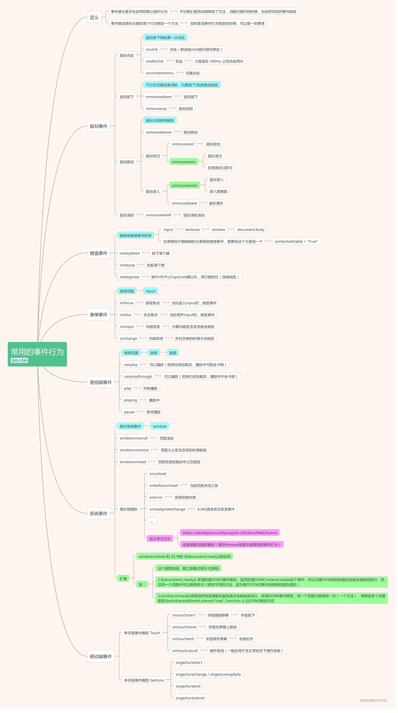
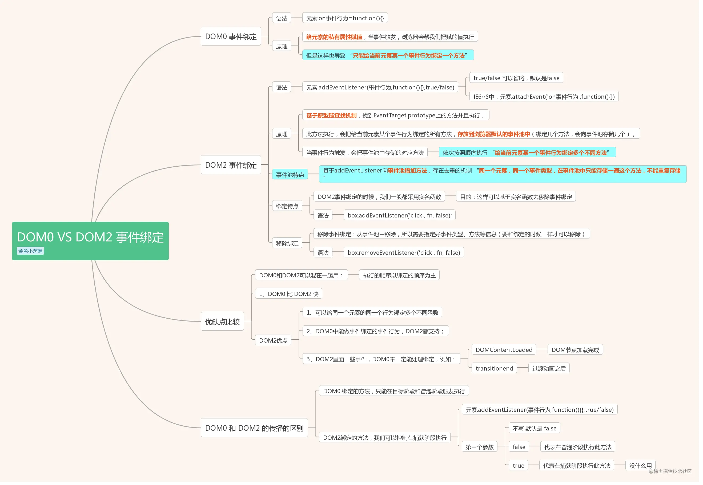
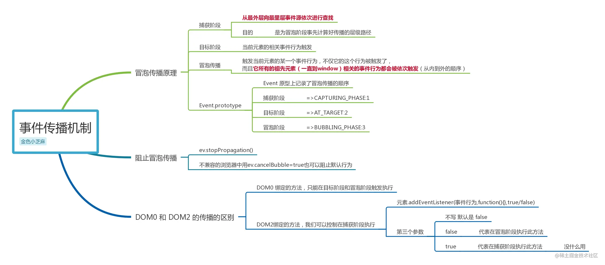
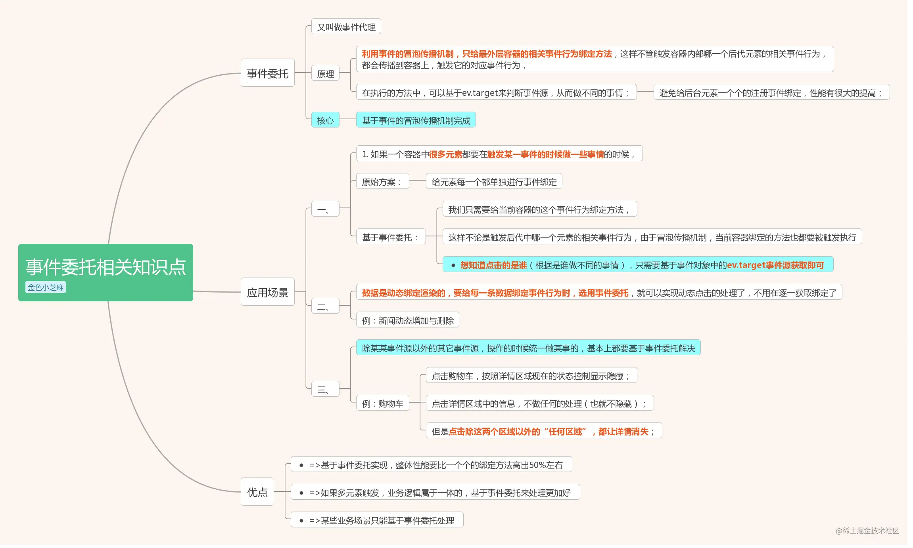

# 事件和事件绑定

## 浏览器常用的事件行为
#### <a href="https://developer.mozilla.org/zh-CN/docs/Web/Events" target="_blank">MDN事件参考地址</a>

   

### 鼠标事件
+ onclick：点击（移动端click被识别为单击）
+ ondblclick：双击（大概是在 300ms 之间点击两次）
+ oncontextmenu：右键点击
+ onmousedown：鼠标按下
+ onmouseup：鼠标抬起
+ onmousewhell：鼠标滚轮滚动
+ onmousemove：鼠标移动
+ onmouseout：鼠标滑出
+ onmouseover：鼠标滑过（在表面经过即可）
+ onmouseenter：鼠标进入（进入到里面）
+ onmouseleave：鼠标离开
:::tip
鼠标点击：鼠标按下弹起算一次点击  
鼠标按下：不分左右键或者滚轮，只要按下/抬起就会触发  
mouseover/mouseout 存在冒泡机制。划过和划出（鼠标在谁身上，相当于划过谁）  
mouseenter/mouseleave 不存在冒泡传播机制。进入和离开。
:::

### 键盘事件
+ onkeydown：按下某个键
+ onkeyup：抬起某个键
+ onkeypress：除Shift/Fn/CapsLock键以外，其它键按住（连续触发）
:::warning
能绑定键盘事件的有：input、textarea、window、document.body 等  
如果想给不能编辑的元素绑定键盘事件，需要给这个元素加一个:contenteditable = "true"
:::

### 表单事件
+ onfocus：获取焦点（光标进入input时，触发事件）
+ onblur：失去焦点（光标离开input时，触发事件）
+ oninput：内容改变（只要内容发生改变就会触发）
+ onchange：内容改变（并且失焦的时候才会触发）

### 音视频事件
+ canplay：可以播放（资源没有加载完，播放中可能会卡顿）
+ canplaythrough：可以播放（资源已经加载完，播放中不会卡顿）
+ play：开始播放
+ playing：播放中
+ pause：暂停播放

### 系统事件
+ window.onscroll：页面滚动
+ window.onresize：页面大小发生改变的时候触发
+ window.onload：页面资源加载完毕之后触发
+ img.onload ：图片加载完成
+ window.onbeforeunload：当前页面关闭之前
+ window.onerror：资源加载失败

### 移动端事件
单手指事件模型 Touch
+ ontouchstart：手指碰到屏幕（手指按下）
+ ontouchmove：手指在屏幕上移动
+ ontouchend：手指离开屏幕（手指松开）
+ ontouchcancel：操作取消（一般应用于非正常状态下操作结束）

多手指事件模型 Gesture
+ ongesturestart：手指碰到屏幕（手指按下）
+ ongesturechange / ongestureupdate：手指在屏幕上移动
+ ongestureend：手指离开屏幕（手指松开）
+ ongesturecancel：操作取消（一般应用于非正常状态下操作结束）

### 其他事件
+ transitionend：动画过渡完成
+ onreadystatechange：AJAX请求状态改变事件

## DOM0 和 DOM2 事件绑定
  

### window.onload 和 $(document).ready()的区别
1. $(document).ready()  
 采用的是DOM2事件绑定，监听的是DOMContentLoaded这个事件，所以只要DOM结构加载完成就会被触发执行，
 而且同一个页面中可以使用多次（绑定不同的方法，因为基于DOM2事件池绑定机制完成的）
2. window.onload  
必须等待所有资源都加载完成才会被触发执行，采用DOM0事件绑定，同一个页面只能绑定一次（一个方法），
想绑定多个也需要改为window.addEventListener('load', function () {})DOM2绑定方式

### DOM0 和 DOM2 的传播的区别
1. DOM0 绑定的方法，只能在目标阶段和冒泡阶段触发执行
2. DOM2绑定的方法，我们可以控制在捕获阶段执行
元素.addEventListener(事件行为,function(){},true/false)
第三个参数：不写 默认是 false
false：代表在冒泡阶段执行此方法
true：代表在捕获阶段执行此方法（基本没用过）。

## 事件传播机制
  

## 事件委托
  