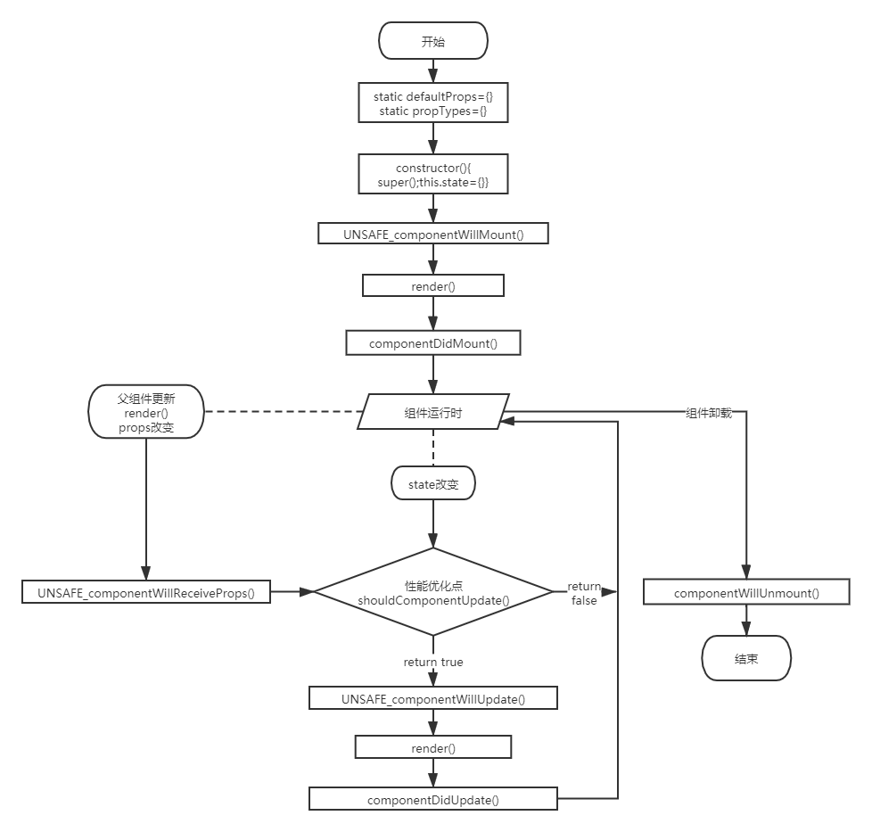

# React
:::tip
用于积累react知识
:::
## 服务端渲染 
<a href="https://www.nextjs.cn/" target="_blank">next.js官方文档</a>

## 生命周期
### 组件挂载
组件在首次创建后，进行第一次的渲染为挂载期。挂载期有的一些方法会被依次触发，列举如下：
+ constructor(构造函数，初始化状态值)
+ getInitialState(设置状态机)
+ getDefaultProps(获取默认的props)
+ UNSAFE_componentWillMount(首次渲染前执行)
+ render(渲染组件)
+ componentDidMount(render渲染之后执行的操作)
```js
//组件挂载
import React from 'react';
import ReactDOM from 'react-dom';
class HelloWorld extends React.Component{
    constructor(props) {
        super(props);
        console.log("1,构造函数");
        this.state={};
        console.log("2,设置状态机");
    }
    static defaultProps={
        name:"React",
    }
    UNSAFE_componentWillMount(nextProps, nextState, nextContext) {
        console.log("3,完成首次渲染前调用");
    }
    render() {
        console.log("4,组件进行渲染");
        return (
            <div>
                <div>{this.props.name}</div>
            </div>
        )
    }
    componentDidMount() {
        console.log("5,componentDidMount render渲染后的操作")
    }
}
ReactDOM.render(<HelloWorld />, document.getElementById('root'));
//浏览器中执行顺序：1，2，3，4，5
``` 

### 组件更新
组件更新，指的是在组件初次渲染后，进行了组件状态的改变。React在生命周期中的更新过程包括以下几个方法:
+ UNSAFE_componentWillReceiveProps :当父组件更新子组件state时，该方法会被调用。
+ shouldComponentUpdate ： 该方法决定组件state或props的改变是否需要重新渲染组件。
+ UNSAFE_componentWillUpdate : 在组件接受新的state或者props时，即将进行重新渲染前调用该方法，和UNSAFE_componentWillMount方法类似。
+ componentDidUpdate : 在组件重新渲染后调用该方法，和componentDidMount方法类似。
```js
//组件更新
class HelloWorldFather extends React.Component{
    constructor(props) {
        super(props);
        this.updateChildProps=this.updateChildProps.bind(this);
        this.state={  //初始化父组件
            name:"React"
        }
    }
    updateChildProps(){  //更新父组件state
        this.setState({
            name:"Vue"
        })
    }
    render() {
        return (
            <div>
                <HelloWorld name={this.state.name} />  {/*父组件的state传递给子组件*/}
                <button onClick={this.updateChildProps}>更新子组件props</button>
            </div>
        )
    }
}
class HelloWorld extends React.Component{
    constructor(props) {
        super(props);
        console.log("1,构造函数");
        console.log("2,设置状态机")
    }
    UNSAFE_componentWillMount() {
        console.log("3,完成首次渲染前调用");
    }
    UNSAFE_componentWillReceiveProps(nextProps, nextContext) {
        console.log("6,父组件更新子组件时调用该方法");
    }
    shouldComponentUpdate(nextProps, nextState, nextContext) {
        console.log("7,决定组件props或者state的改变是否需要重新进行渲染");
        return true;
    }
    UNSAFE_componentWillUpdate(nextProps, nextState, nextContext) {
        console.log("8,当接收到新的props或state时，调用该方法");
    }
    render() {
        console.log("4,组件进行渲染");
        return (
            <div>
                <div>{this.props.name}</div>
            </div>
        )
    }
    componentDidMount() {
        console.log("5,componentDidMount render后的操作");
    }
    componentDidUpdate(prevProps, prevState, snapshot) {
        console.log("9,组件被重新选然后调用该方法");
    }
}
ReactDOM.render(<HelloWorldFather />,document.getElementById("root"));
//浏览器中执行顺序：1，2，3，4，5
//点击“更新子组件props”后：6，7，8，4，9
```
### 组件卸载
生命周期的最后一个过程为组件卸载期，也称为组件销毁期。该过程主要涉及一个 方法，即componentWillUnmount，当组件从DOM树删除的时候调用该方法。
```js
//组件卸载
class HelloWorldFather extends React.Component{
    constructor(props) {
        super(props);
        this.updateChildProps=this.updateChildProps.bind(this);
        this.state={  //初始化父组件
            name:"React"
        }
    }
    updateChildProps(){  //更新父组件state
        this.setState({
            name:"Vue"
        })
    }
    render() {
        return (
            <div>
                <HelloWorld name={this.state.name} />  {/*父组件的state传递给子组件*/}
                <button onClick={this.updateChildProps}>更新子组件props</button>
            </div>
        )
    }
}
class HelloWorld extends React.Component{
    constructor(props) {
        super(props);
        console.log("1,构造函数");
        console.log("2,设置状态机")
    }
    UNSAFE_componentWillMount() {
        console.log("3,完成首次渲染前调用");
    }
    UNSAFE_componentWillReceiveProps(nextProps, nextContext) {
        console.log("6,父组件更新子组件时调用该方法");
    }
    shouldComponentUpdate(nextProps, nextState, nextContext) {
        console.log("7,决定组件props或者state的改变是否需要重新进行渲染");
        return true;
    }
    UNSAFE_componentWillUpdate(nextProps, nextState, nextContext) {
        console.log("8,当接收到新的props或state时，调用该方法");
    }
    delComponent(){  //添加卸载方法
        ReactDOM.unmountComponentAtNode(document.getElementById("root"));
    }
    render() {
        console.log("4,组件进行渲染");
        return (
            <div>
                <div>{this.props.name}</div>
                <button onClick={this.delComponent}>卸载组件</button>  {/*声明卸载按钮*/}
            </div>
        )
    }
    componentDidMount() {
        console.log("5,componentDidMount render后的操作");
    }
    componentDidUpdate(prevProps, prevState, snapshot) {
        console.log("9,组件被重新选然后调用该方法");
    }
    componentWillUnmount() {  //组件卸载后执行
        console.log("10,组件已被卸载");
    }
}
ReactDOM.render(<HelloWorldFather />,document.getElementById("root"));
//浏览器中执行顺序：1，2，3，4，5
//点击卸载按钮后: 10
```

### 图示
  

## Hook
<a href="https://zh-hans.reactjs.org/docs/hooks-intro.html" target="_blank">Hook官网文档</a>

```
//数据以及设置数据的方法
const [count, setCount] = useState(0);
//数组解构 const foo = ['one', 'two']; const [red, yellow] = foo;

// Similar to componentDidMount and componentDidUpdate:
  useEffect(() => {
    // Update the document title using the browser API
    document.title = `You clicked ${count} times`;
  });
```
 + useEffect Hook 看做 componentDidMount，componentDidUpdate 和 componentWillUnmount 这三个函数的组合。  
 + 每次更新的时候都要运行 Effect,在return函数中做清空操作
## 知识点
### setState
出于性能考虑，React 可能会把多个 setState() 调用合并成一个调用。
因为 this.props 和 this.state 可能会异步更新，所以你不要依赖他们的值来更新下一个状态。
例如，此代码可能会无法更新计数器。  
要解决这个问题，可以让 setState() 接收一个函数而不是一个对象。这个函数用上一个 state 作为第一个参数，将此次更新被应用时的 props 做为第二个参数：
```js
// Wrong
this.setState({
  counter: this.state.counter + this.props.increment,
});

// Correct
this.setState((state, props) => ({
  counter: state.counter + props.increment
}));
```