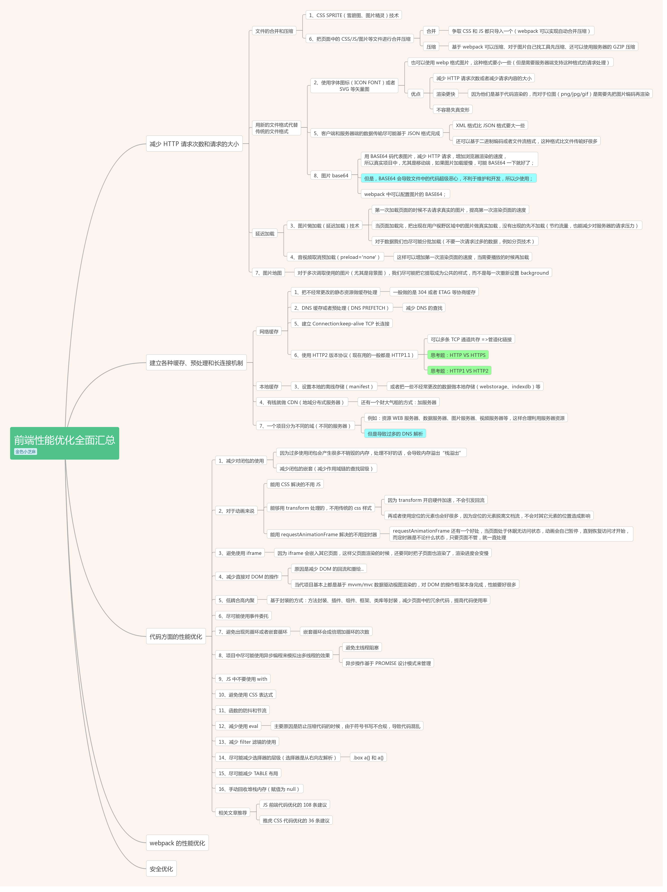

# 前端性能优化
## 思维导图
   

## window.performance
+ DNS查询耗时 = domainLookupEnd - domainLookupStart
+ TCP链接耗时 = connectEnd - connectStart
+ request请求耗时 = responseEnd - responseStart
+ 解析dom树耗时 = domComplete - domInteractive
+ 白屏时间 = domloading - fetchStart
+ domready可操作时间 = domContentLoadedEventEnd - fetchStart
+ onload总下载时间 = loadEventEnd - fetchStart

